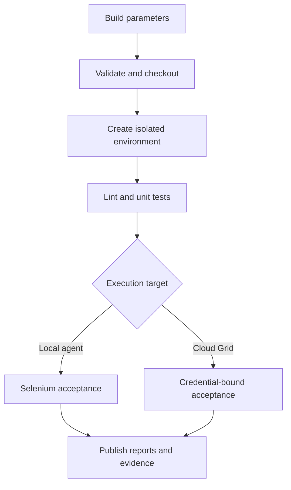

# Jenkins Selenium Delivery Pipeline

[](https://github.com/yasirsavanur/Jenkins-CI/actions/workflows/quality-gates.yml)
[](https://www.jenkins.io/)
[](https://www.selenium.dev/)

A complete, parameterised Jenkins pipeline for Python, pytest, and Selenium 4 acceptance testing. The project can run reliably on a local Jenkins agent or, when credentials are supplied, against the LambdaTest cloud Grid.

This is a working pipeline-as-code showcase—not a collection of tests waiting for a `Jenkinsfile`.

## What it demonstrates

- Declarative Pipeline stored with the application source
- validated build parameters for suite, target, browser, headless mode, and parallelism
- reproducible Python environment creation on every build
- separate static-analysis, unit-test, and browser-acceptance stages
- Jenkins Credentials Binding with no cloud secrets in source or command output
- local Chrome/Firefox sessions and Selenium 4 remote sessions using browser options
- pytest-xdist parallel execution
- JUnit trend data, self-contained HTML reports, screenshots, and page source
- artifact fingerprints, build retention, timeouts, concurrency control, and cleanup
- a containerised Jenkins LTS demo with Python, Chromium, and required plugins included

## Pipeline flow



Results are published in the `post { always { ... } }` block, so a failed test still leaves useful evidence in Jenkins.

## Build parameters

| Parameter | Choices / default | Effect |
|---|---|---|
| `TEST_SUITE` | `smoke`, `regression`, `mobile` | Selects the matching pytest marker |
| `EXECUTION_TARGET` | `local`, `lambdatest` | Chooses the Jenkins agent or cloud Grid |
| `BROWSER` | `chrome`, `firefox` | Chooses the requested desktop browser |
| `HEADLESS` | enabled | Hides the local browser window |
| `WORKERS` | `1`, `2`, `4` | Controls pytest-xdist concurrency |

The pipeline rejects the unsupported `mobile` + `firefox` combination before provisioning the test environment.

## Repository map

```text
Jenkinsfile                    # complete Declarative Pipeline
Dockerfile                     # Jenkins LTS + Python + Chromium
compose.yaml                   # persistent local Jenkins service
plugins.txt                    # pipeline/report/credential plugins
src/pipeline_suite/
├── config.py                  # validated build settings
├── driver_factory.py          # local and cloud sessions
└── pages/todo_page.py         # explicit-wait page object
demo_app/                      # deterministic local acceptance target
tests/
├── acceptance/                # smoke, regression, and mobile journeys
├── support/                   # ephemeral local web server
└── unit/                      # framework and pipeline contracts
```

## Run the suite without Jenkins

Prerequisites: Python 3.10+ and Chrome or Firefox.

```bash
python -m venv .venv
source .venv/bin/activate          # Windows: .venv\Scripts\activate
python -m pip install --upgrade pip
python -m pip install -e ".[test]"

pytest -m unit
pytest -m smoke --target local --browser chrome
pytest -m regression --target local --browser firefox -n 2
pytest -m mobile --target local --browser chrome
```

The local suite starts the bundled Todo application on an available port and shuts it down when the test session ends. No account or live third-party test site is needed for the default path.

Generate the same report formats used by Jenkins:

```bash
pytest -m regression --target local --browser chrome -n 2 \
  --junitxml=reports/acceptance.xml \
  --html=reports/report.html \
  --self-contained-html
```

Or use the convenience targets:

```bash
make install
make check
make smoke
make report
```

## Start Jenkins locally

The included image is ideal for exploring this repository on one machine. Production installations should normally execute builds on dedicated agents.

```bash
docker compose up --build -d
docker compose exec jenkins cat /var/jenkins_home/secrets/initialAdminPassword
```

1. Open `http://localhost:8080` and complete the setup wizard with the printed password.
2. Create a **Pipeline** item and choose **Pipeline script from SCM**.
3. Select Git, enter this repository URL, and leave the script path as `Jenkinsfile`.
4. Save, then choose **Build with Parameters**.

The image extends `jenkins/jenkins:lts-jdk21`, preinstalls Python, Chromium/ChromeDriver, and installs the plugins listed in `plugins.txt`. The named `jenkins_home` volume keeps local configuration and build history between restarts.

Stop the service without deleting that volume:

```bash
docker compose down
```

## Configure cloud execution

Local execution is the default. To enable the optional LambdaTest target:

1. In Jenkins, open **Manage Jenkins → Credentials**.
2. Add a **Username with password** credential.
3. Put the LambdaTest username in the username field and access key in the password field.
4. Set the credential ID to exactly `lambdatest-credentials`.
5. Run the job with `EXECUTION_TARGET=lambdatest`.

The `withCredentials` block exposes `LT_USERNAME` and `LT_ACCESS_KEY` only while the cloud test command runs. The Python driver factory URL-encodes those values and uses Selenium 4 `options`, including the `LT:Options` capability namespace.

For direct CLI use:

```bash
export LT_USERNAME="your-username"
export LT_ACCESS_KEY="your-access-key"

pytest -m smoke --target lambdatest --browser chrome \
  --build-name "manual verification"
```

Cloud runs package the same bundled Todo target into a self-contained `data:` URL, so the remote browser does not need a public deployment or tunnel. Pass `--base-url` to target another compatible, publicly reachable environment. `LT_GRID_URL` and `LT_PLATFORM` can also override their defaults.

## Reports and diagnostics

Jenkins always attempts to publish:

| Output | Jenkins behaviour |
|---|---|
| `reports/framework.xml` | unit-test trend and failure data |
| `reports/acceptance.xml` | browser-test trend and failure data |
| `reports/report.html` | linked, self-contained pytest report |
| `reports/*.png` | screenshot captured on failure |
| `reports/*.html` | matching page source captured on failure |

All report files are archived and fingerprinted before the workspace is cleaned.

## Jenkins agent contract

For Jenkins installations that do not use the included image, the selected agent needs:

- Python 3.10+ with the `venv` module
- Chrome/Chromium or Firefox for local execution
- outbound access to Python package indexes
- outbound HTTPS access to the cloud Grid when `lambdatest` is selected

No globally installed Python packages are required; the pipeline creates `.venv` inside the workspace.

## Design decisions

- **Reliable by default:** the local target is bundled with the repository; cloud execution is an opt-in integration.
- **One pipeline, multiple modes:** parameters change test selection and infrastructure without duplicating jobs.
- **Fail with evidence:** test failures are allowed to fail the build, while `post` actions still publish diagnostics.
- **Modern WebDriver contract:** browser options replace the removed `desired_capabilities` argument, and explicit waits replace implicit waits.
- **Tested pipeline expectations:** unit tests protect parameter names, credential binding, and required report publishers from accidental removal.

## License

MIT
